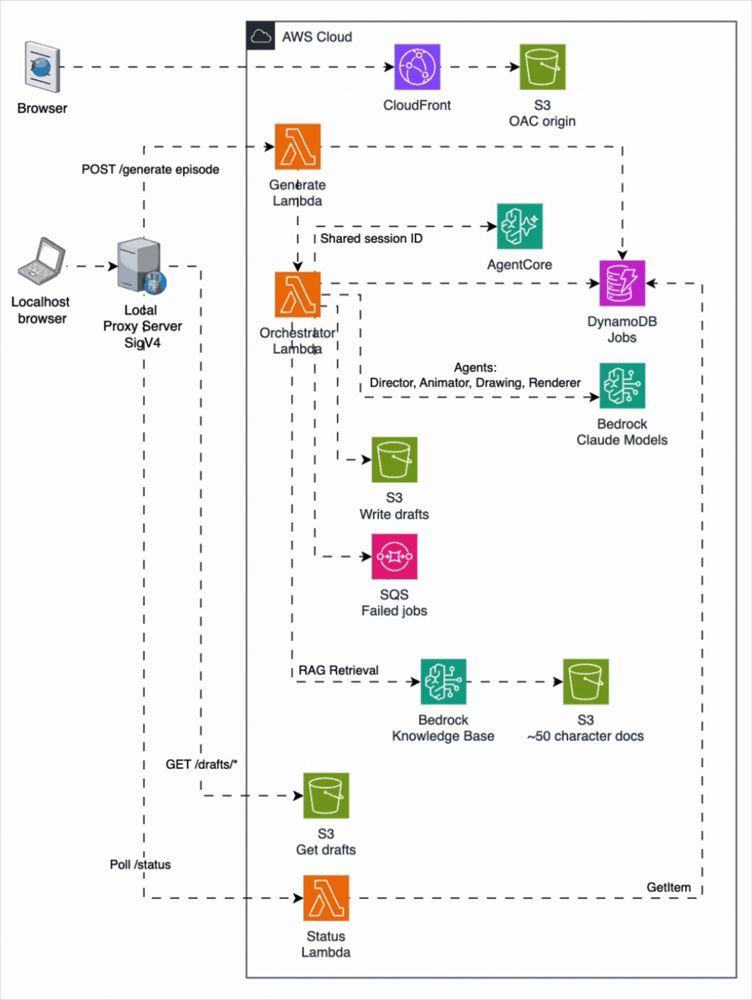

# Linions

**AI-powered interactive animated stories -- generated entirely by AI, including all SVG art and animations.**

[](https://linions.odedkeren.dev/story/kerenoded/cee4bcd2-3572-4788-8e94-1a705f4f7ecd)

*Click to play -- runs in any browser, no setup required*

[Browse the full live gallery](https://linions.odedkeren.dev/)

---

## What is this?

A developer types a natural language prompt in a local creator studio. A pipeline of four
specialized AI agents running on AWS generates a short branching animated episode -- complete
with story script, character choreography, hand-drawn obstacle and background art, and
frame-by-frame SVG animation. Once published, anyone can play the episode interactively in a
browser with no setup, no account, and no install.

**This is a pure AI project.** The story script, the choreography, every SVG obstacle, every
background, and every frame of animation are generated by Claude on Amazon Bedrock. No images
were created externally and vectorized. The hand-drawing aesthetic is intentional -- the
project explores what happens when you ask a language model to draw freehand SVGs, and it
turns out the results have real character and charm.

Different Claude models produce noticeably different drawing quality. Claude Opus 4.6
consistently produced the best hand-drawn SVG results for this project.

📺 [See the comparison in action](https://www.youtube.com/shorts/IpTrvC5mAkg) — same prompt across different Claude models, Terminator style.

---

## See it in action


*From prompt to playable episode -- the local creator studio drives the full generation pipeline.*

### Example generated scenes

A few representative approach clips generated by the pipeline:

<p align="center">
  
  
</p>
<p align="center">
  
  
</p>

*These are raw repo-hosted SVG outputs rendered directly by GitHub's README viewer, not screenshots.*

---

## Architecture



The generation pipeline runs inside a single orchestrator Lambda: RAG retrieval, Director
agent (story script), Animator agent (choreography), Drawing agent (SVG art), and Renderer
agent (final animation) -- each gated by a deterministic validator before proceeding.

---

## Production-quality patterns

- **Multi-agent orchestration** -- 4 specialized AI agents (Director, Animator, Drawing,
  Renderer) coordinated by a single orchestrator Lambda
- **Deterministic validation at every stage** -- pure-function validators (`ScriptValidator`,
  `FrameValidator`, `SvgLinter`) gate every AI output before it proceeds; nothing from an LLM
  goes anywhere raw
- **Automatic retry with exact error feedback** -- when validation fails, the exact errors are
  fed back to the model in a retry prompt (up to configurable retry count)
- **SVG repair pipeline** -- the SVG linter doesn't just reject; it sanitises and repairs
  common model mistakes (tag stripping, namespace cleanup, size enforcement)
- **Caching for cost and latency** -- obstacle SVGs are cached by slug across episodes;
  background SVGs are cached per act; the bundled obstacle library (26 pre-drawn SVGs) avoids
  redundant Bedrock calls entirely
- **RAG-augmented character consistency** -- a Bedrock Knowledge Base with ~50 hand-authored
  character documents ensures Linai's personality, reactions, and visual vocabulary are
  consistent across all generated episodes
- **Dead Letter Queue** -- failed orchestrator invocations are captured in SQS for inspection
  and replay, not silently lost
- **AgentCore session management** -- all agents in a generation job share a single AgentCore
  session ID, preparing the architecture for cross-episode memory in future versions
- **Parallel generation** -- the Animator, Drawing, and Renderer agents all fan out Bedrock
  calls in parallel (per-act, per-asset, per-clip) with independent retry, reducing
  end-to-end latency
- **Cost guardrails** -- per-stage token ceilings prevent runaway Bedrock spend; the entire
  infrastructure has near-zero idle cost (< $1/month with no generation)
- **Least-privilege IAM** -- the orchestrator Lambda role is scoped to only the specific
  DynamoDB table, S3 bucket prefixes, Bedrock models, Knowledge Base, and AgentCore resources
  it needs; no `*` resources in any IAM policy statement
- **Structured observability** -- every agent call emits structured JSON logs with agent name,
  token count, validation result, retry count, and duration
- **Security by default** -- Lambda Function URLs with IAM auth, S3 blocked from public
  access, CloudFront OAC, SVG sanitisation before any S3 write, all episode content escaped
  before DOM insertion
- **100% test coverage on validators** -- all validators are pure functions tested with
  passing and failing cases; CDK assertion tests verify security-critical properties
- **Single-stack deployment** -- one `cdk deploy` gives any developer the complete system in
  their own AWS account

---

## How it works

1. Developer types a prompt in the local creator studio
2. RAG retrieval from Bedrock Knowledge Base (character context)
3. Director agent generates a branching story script (2-3 acts, choices, outcomes)
4. Script validator gates the output
5. Animator agent generates keyframe choreography (one Bedrock call per act, in parallel)
6. Frame validator gates each act
7. Drawing agent generates obstacle + background SVGs for any not in the cache/library (in parallel)
8. Renderer agent composes final SVG clips with full animation (one Bedrock call per clip, in parallel)
9. SVG linter sanitises every clip
10. Episode JSON + thumbnail assembled and saved

---

## Live gallery

[Browse all published episodes](https://linions.odedkeren.dev/) -- 10 published
episodes, all generated by the pipeline, playable by anyone in a browser with no setup.

---

## About this project

This is a personal project built to investigate AI-generated SVG hand-drawing capabilities
and explore what happens when you give a language model full creative control over freehand
vector art and animation. However, it is not maintained as a product and comes with no
guarantees.

---

## For developers

**Prerequisites:**
- AWS account with Bedrock access (Claude Sonnet and Opus models enabled in your region)
- AWS CLI configured (`aws configure`) and CDK bootstrap run once (`npx cdk bootstrap aws://ACCOUNT/REGION`)
- Node.js 20+, Python 3.11+, `jq`
- GitHub CLI (`gh`) for the publish workflow

**Quickstart:**

**1. Install dependencies**
```bash
pip install -r requirements.lock
npm install
npm install --prefix infra
npm install --prefix proxy
npm install --prefix frontend
```

**2. Build the frontend** (required before deploy — CDK uploads `frontend/dist-public` to S3)
```bash
npm --prefix frontend run build
```

**3. Deploy to AWS (first time only)**
```bash
npm run cdk -- deploy
```

**4. Populate local env from the deployed stack**
```bash
bash scripts/setup-env.sh
```

**5. Start the local creator studio**
```bash
npm --prefix proxy start
```

Open `http://localhost:3000` — that is the local creator studio.

**Creating and publishing an episode:**

1. Type your prompt at `http://localhost:3000` and generate the episode locally
2. Preview and review it in the browser — the episode only exists on your machine at this point
3. Click **Publish** in the creator studio to write the episode JSON and assets to the repo
4. After publishing, run `npm run cdk -- deploy` to sync the new episode to S3 and make it live on CloudFront — the publish button alone does not update the live site

See [SCRIPTS.md](SCRIPTS.md) for the full command reference, local development flow, debug
runners, and publication workflow.

See [DESIGN.md](DESIGN.md) for agent contracts, JSON schemas, and data flow.

---

## Contribute an episode

Want to see your own AI-generated episode on the [live Linions gallery](https://linions.odedkeren.dev/)? Here's how:

1. Clone the repo and deploy the stack to your own AWS account (see quickstart above)
2. Generate episodes using the local creator studio — experiment with different prompts
3. Reach out to request contributing access and commit permissions
4. Once approved, publish your episode and open a PR — your episodes will go live on the Linions website

Every contributor's episodes are attributed to their GitHub username. The more people generate
episodes, the richer the gallery gets. All generation costs run on your own AWS account
(typically under $0.50 per episode).

---

## Tech stack

| Layer | Technology |
|-------|------------|
| Infrastructure as Code | AWS CDK (TypeScript) |
| Compute | AWS Lambda (Python 3.11) |
| AI Models | Claude on Amazon Bedrock (Sonnet for agents, Opus for drawing) |
| RAG | Amazon Bedrock Knowledge Bases |
| Session Management | AWS AgentCore |
| Storage | Amazon S3, Amazon DynamoDB |
| CDN | Amazon CloudFront |
| Dead Letter Queue | Amazon SQS |
| Frontend | TypeScript, pure SVG/CSS animation |
| Local Proxy | Node.js |

---

## Legal notice

Linai and the Linions characters are original creations. All character designs, story content,
and software in this repository are the property of the project owner. All rights reserved.
